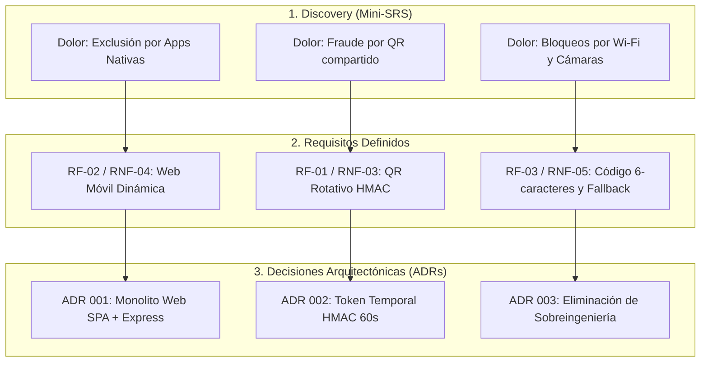

# Documento de Discovery (Inception & Requisitos del Producto)

**Proyecto:** Sistema de Control de Asistencia Académica SENA (`sena-attendance-system`)  
**Programa de Formación:** Análisis y Desarrollo de Software (ADSO) — Ficha: `3413974`  
**Institución:** Centro de Formación SENA  
**Fecha:** Agosto 2026  
**Versión:** 1.0.0 (Alineado con Gobernanza y ADRs)  

---

## 1. Resumen Ejecutivo y Ficha Técnica

El presente documento de **Discovery** constituye el artefacto fundamental de ingeniería de software para el entendimiento del problema, el análisis de necesidades del aula y la especificación de requisitos del sistema `sena-attendance-system`. 

Actúa como un **Mini-SRS (Software Requirements Specification)** ágil que justifica la génesis del proyecto, define el alcance, caracteriza a los usuarios finales y establece los cimientos requeridos para sustentar las decisiones arquitectónicas documentadas en los **ADRs** (Architectural Decision Records).

```
┌─────────────────────────────────────────────────────────────────────────────┐
│                       FICHA TÉCNICA DEL PROYECTO                            │
├─────────────────────────────────────────────────────────────────────────────┤
│ • Nombre del Sistema: sena-attendance-system                                │
│ • Tipo de Solución: Aplicación Web Monolítica Responsive (Mobile-First)     │
│ • Stack Tecnológico: Node.js (Express), Vanilla JS, Tailwind CSS, SQLite/PG  │
│ • Dominio: Control de Presencia y Gestión de Tiempos Académicos SENA        │
│ • Normativa Legal: Ley 1581 de 2012 de Protección de Datos (Habeas Data)    │
└─────────────────────────────────────────────────────────────────────────────┘
```

---

## 2. Planteamiento del Problema (The Problem Statement)

En los ambientes de formación y laboratorios de informática del SENA, el control de asistencia tradicional presenta fallas estructurales que afectan el tiempo lectivo y la veracidad de los registros:

1. **Pérdida Crítica de Tiempo Pedagógico:** El llamado a lista verbal toma entre **15 y 25 minutos** en grupos de 30 a 40 aprendices, restando horas efectivas de formación técnica.
2. **Vulnerabilidad a la Suplantación y Fraude:** El registro físico en hojas de papel permite que aprendices firmen por compañeros ausentes o compartan enlaces de formularios públicos sin verificación de presencia en el aula.
3. **Falta de Trazabilidad en Llegadas Tardías:** El modelo binario tradicional (Presente / Falla) no computa de forma justa el tiempo real cuando un aprendiz llega 1 o 2 horas tarde, generando inconsistencias en los reportes de horas formativas.
4. **Exclusión por Barreras Tecnológicas:** Sistemas digitales previos fracasaron al exigir la instalación de apps móviles pesadas (APK/Play Store), bloquear a estudiantes sin cámara de alta gama o requerir conexiones estrictas a redes Wi-Fi que fallan en el aula.

---

## 3. Propósito y Visión del Producto (Product Vision)

### Declaración de Visión:
> *"Para los instructores y aprendices del SENA que necesitan un mecanismo rápido y veraz de control de asistencia, **`sena-attendance-system`** es una plataforma web móvil ligera que permite registrar la presencia en menos de 3 segundos mediante códigos QR dinámicos rotativos y cálculo fraccionado de puntualidad, garantizando cero exclusión tecnológica y auditoría institucional transparente."*

### Objetivos Específicos:
* **Reducir el tiempo de registro** de 20 minutos a menos de **3 segundos por aprendiz**.
* **Eliminar el fraude de asistencia remota** mediante tokens QR dinámicos calculados en ventanas de 60 segundos con firma HMAC.
* **Calcular automáticamente la puntualidad fraccionada** descontando bloques horarios proporcionales a la hora de llegada tras el margen de gracia de 15 minutos.
* **Garantizar inclusión total** a través de métodos de contingencia: ingreso con código manual de 6 caracteres y anulación/marcación manual (**Override**) por parte del instructor.
* **Asegurar cumplimiento normativo** de la **Ley 1581 de 2012** (Habeas Data) con consentimiento explícito y derecho a la supresión de datos.

---

## 4. Arquetipos de Usuario y Puntos de Dolor (User Personas)

```
┌─────────────────────────────────────────────────────────────────────────────┐
│ 👤 APRENDIZ SENA (Tomás)                                                    │
│ • Perfil: Joven en formación técnica/tecnológica en ADSO.                   │
│ • Contexto: Dispositivo móvil de gama media/baja, datos móviles limitados.  │
│ • Dolores: La app se cuelga, el proyector no enfoca, no tiene espacio      │
│   para instalar apps nativas, llega 20 min tarde y le ponen falla total.   │
│ • Necesidad: Escanear rápido, auto-registrarse si es nuevo y ver sus horas. │
├─────────────────────────────────────────────────────────────────────────────┤
│ 👨‍🏫 INSTRUCTOR SENA (Jesús)                                                 │
│ • Perfil: Docente técnico encargado de liderar la sesión académica.         │
│ • Contexto: Laptop conectada al proyector del ambiente de clase.            │
│ • Dolores: Perder tiempo llamando a lista, lidiar con excusas en papel,     │
│   elaborar reportes manuales en Excel al final del mes.                     │
│ • Necesidad: Abrir sala con 1 clic, ver presentes en vivo y exportar Excel. │
├─────────────────────────────────────────────────────────────────────────────┤
│ 👔 COORDINADOR ACADÉMICO                                                    │
│ • Perfil: Directivo responsable de auditar la calidad formativa del centro. │
│ • Contexto: Panel administrativo institucional.                             │
│ • Dolores: No saber si las clases realmente se ejecutaron en el aula.       │
│ • Necesidad: Auditar evidencias fotográficas y gestionar fichas/docentes.   │
└─────────────────────────────────────────────────────────────────────────────┘
```

---

## 5. Matriz de Requisitos Funcionales (RF)

| ID | Nombre del Requisito | Descripción Funcional | Prioridad (MoSCoW) |
|---|---|---|---|
| **RF-01** | **Apertura de Sala y QR Dinámico** | El instructor debe poder abrir una sala de asistencia con cronómetro de 15 minutos y proyectar un código QR con tokens HMAC rotativos cada 60s. | **MUST HAVE** |
| **RF-02** | **Registro de Asistencia del Aprendiz** | El aprendiz debe poder registrar su presencia ingresando su documento y contraseña desde el navegador móvil al escanear el QR. | **MUST HAVE** |
| **RF-03** | **Contingencia por Código Manual** | En caso de fallas de cámara, el sistema debe permitir ingresar un código alfanumérico de 6 caracteres visible en la pantalla del instructor. | **MUST HAVE** |
| **RF-04** | **Cálculo de Puntualidad Fraccionada** | El sistema debe otorgar 6 horas completas en los primeros 15 min de tolerancia; tras este lapso, descontar horas por bloques según la hora de llegada. | **MUST HAVE** |
| **RF-05** | **Marcación Manual (Override)** | El instructor debe poder registrar manualmente la asistencia de aprendices sin batería o sin dispositivo desde su grilla en vivo. | **MUST HAVE** |
| **RF-06** | **Auto-registro en Caliente** | Aprendices que asisten por primera vez o trasladados deben poder crear su cuenta y marcar asistencia inmediatamente. | **MUST HAVE** |
| **RF-07** | **Solicitudes Tardías (Late Requests)**| Aprendices que lleguen tras el cierre oficial de la sala pueden enviar una solicitud de justificación para validación del docente. | **SHOULD HAVE** |
| **RF-08** | **Bandeja de Excusas e Incapacidades**| Los aprendices pueden subir soportes digitales (Base64) de inasistencias pasadas para aprobación del instructor. | **SHOULD HAVE** |
| **RF-09** | **Evidencia Fotográfica de Jornada** | El instructor debe adjuntar una fotografía del aula al cerrar la sala para auditoría de coordinación. | **SHOULD HAVE** |
| **RF-10** | **Exportación de Reportes XLSX y PDF** | El instructor y coordinador pueden exportar la matriz de asistencia en hojas de cálculo Excel (`.xlsx`) y PDF institucional SENA. | **SHOULD HAVE** |
| **RF-11** | **Gestión CRUD de Fichas e Instructores** | El coordinador puede crear, editar y asignar instructores a fichas académicas. | **SHOULD HAVE** |
| **RF-12** | **Cumplimiento Habeas Data (Ley 1581)** | Modal de aceptación de tratamiento de datos y botón de auto-supresión definitiva de cuenta en el portal del aprendiz. | **MUST HAVE** |
| **RF-13** | **Cambio Forzado de Contraseña** | Obligatoriedad de cambio de contraseña en el primer login para usuarios sembrados con documento por defecto. | **SHOULD HAVE** |

---

## 6. Matriz de Requisitos No Funcionales (RNF - Calidad ISO/IEC 25010)

| ID | Dimensión | Especificación del Requisito No Funcional |
|---|---|---|
| **RNF-01** | **Rendimiento y Tiempo de Respuesta** | El procesamiento del registro de asistencia (validación de token, chequeo de horario e inserción en BD) debe completarse en menos de **500 ms**, con un flujo de usuario total inferior a **3 segundos**. |
| **RNF-02** | **Simplicidad de Despliegue y Mantenibilidad** | El sistema debe funcionar bajo una arquitectura monolítica web en un único proceso Node.js, con persistencia conmutable (SQLite local sin necesidad de Docker / PostgreSQL en la nube). |
| **RNF-03** | **Seguridad y Criptografía** | Autenticación basada en JSON Web Tokens (JWT con expiración de 24h), contraseñas cifradas con algoritmo Bcrypt (costo 10) y sanitización estricta contra inyecciones XSS y SQL. |
| **RNF-04** | **Portabilidad y Diseño Responsive** | Interfaz Single Page Application (SPA) construida en HTML5, Vanilla JS y Tailwind CSS, 100% adaptable a pantallas móviles desde 320px de ancho sin requerir compilación nativa. |
| **RNF-05** | **Resiliencia y Flexibilidad de Red** | La validación de subred IP debe ser permisiva para no bloquear aprendices que utilicen datos móviles personales (4G/5G) y tolerar latencias de red mediante una ventana de gracia de 10 minutos en tokens QR activos. |

---

## 7. Trazabilidad: De los Requisitos del Discovery a las Decisiones de Arquitectura (ADRs)

Este análisis de Discovery fundamenta directamente las decisiones arquitectónicas registradas en los **ADRs**:



* **Relación con ADR 001:** La necesidad de no exigir instalación de APKs a los aprendices y permitir despliegue inmediato con `npm run dev` justificó la elección del **Monolito Web SPA + Express + SQLite**.
* **Relación con ADR 002:** El riesgo de fraude por capturas de pantalla compartidas en WhatsApp justificó el algoritmo de **Token QR Rotativo firmado con HMAC**.
* **Relación con ADR 003:** La identificación en Discovery de que los celulares de gama de entrada sufrían lentitud con redes neuronales y que los aprendices usan datos móviles justificó la **eliminación de sobreingeniería** (biometría flexible con fallback a 15s, rotación a 60s y chequeo de IP permisivo).
